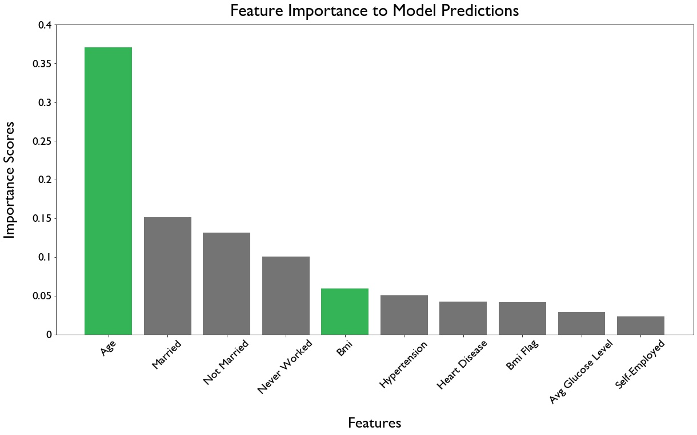

# Stroke Diagnostic Modeling

**Authors**: Anita Camlic, Eddie Juarez, Dermot O'Brien

## Overview
According to the World Health Organization (WHO), strokes are the 2nd leading cause of death globally, responsible for approximately 11% of total deaths. With the use of patient health and history data, as well as advanced modeling techniques, we hope to gain a better understanding of what makes a patient more likely to have a stroke. 

## Business Problem
Hospitals are constantly looking for new ways to detect health risks in their patients before they occur. We have been asked by Mount Sinai's Diagnostic team to create a model that can predict the likelihood of a stroke in their patients with the use of patient data. The model will flag patients who are at risk of a stroke and will give their general practitioners the opportunity to work with them on health plans in hopes of prevention. The model will act as a preliminary diagnostic tool available for all doctors, allowing them to better serve their patients. We will also highlight the features of the model that contribute the most to the models predictions.

## Data
For our model we used a dataset with 5,110 observations and 12 features. 
Below are the 12 features and the data contained in them.

### Data 
- `id`: unique identifier
- `gender`: "Male", "Female" or "Other"
- `sex`: Sex
- `age`: age of the patient
- `hypertension`: 0 if the patient doesn't have hypertension, 1 if the patient has hypertension
- `heart_disease`: 0 if the patient doesn't have any heart diseases, 1 if the patient has a heart disease
- `ever_married`: "No" or "Yes"
- `work_type`: children", "Govt_job", "Never_worked", "Private" or "Self-employed"
- ` Residence_type`: "Rural" or "Urban"
- `avg_glucose_level`: average glucose level in blood
- `bmi`: body mass index
- `smoking_status`: "formerly smoked", "never smoked", "smokes" or "Unknown"
- `stroke`: 1 if the patient had a stroke or 0 if not

**Note:** "Unknown" in smoking_status means that the information is unavailable for this patient

## Methods

We used binary classification algorithms to learn from our dataset and classify new observations as either at risk or not at risk of a stroke. Our best performing model was an XGBoost model with tuned hyperparameters. 

## Results
We chose recall as our important metric to measure because it is associated with decreasing the amount of false negative values of our model - this lessens the chances of our model flagging an at risk patient as not at risk, a scenario that is more costly than flagging a non at risk patient as at risk. Our final recall score was 98%. This means that our model, when ran on unseen data, predicted true positives correctly 98% of the time. This high percentage can be attributed to class imbalance; however, it is still an impressive result. XGBoost works well in this scenario - combining the power of gradient boosting with optimized algorithms, handling complex relationships between variables, handling missing data, and providing strong predictive performance. With a final recall score very similar to our cross val scores, we can be confident that the model will adapt well to new, unseen data, making it valuable to a variety of healthcare institutions.


### Visual 1


### Visual 2


### Visual 3


## Conclusions

We recommend that Mount Sinai takes our model and incorporates it as a tool for their doctors in preliminary diagnostics for their patients. Once doctors identify patients that are at risk of stroke, they can work to build comprehensive health plans to combat and lessen the chances of a stroke. The two attributes of a person we think doctors should focus most on are the age of the patient and their bmi levels. Our models have shown that these two features contribute greatly to the prediction of stroke cases. When focusing on patients, they should look to treat those older patients first, as well as those with high bmi's, possibly working to lower their bmi's as well.

To aid the comprehensiveness of our model, we hope to add more patient data and more health and history features to our model. We also would like to apply similar model techniques to health data to predict other illnesses like heart disease.

## For More Information

Please review our full analysis in [our Jupyter Notebook](./Final_Notebook.ipynb) or our [presentation](./Stroke_Diagnostic_Modeling_Presentation.PDF).

For any additional questions, please contact **Anita Camlic & anitacamlic@gmail.com, Eddie Juarez & ejuarez.nyc@gmail.com, Dermot O'Brien & dermot.obri@gmail.com**

## Repository Structure


```
├── README.md                                    <- The top-level README for reviewers of this project
├── Final_Notebook.ipynb                         <- Narrative documentation of analysis in Jupyter notebook
├── Stroke_Diagnostic_Modeling_Presentation.pdf  <- PDF version of project presentation
├── Data                                         <- Sourced externally 
├── Images                                       <- Sourced externally 
├── Results                                      <- Generated from code
└── Working_Notebooks                            <- Scratch notebooks                        
```
