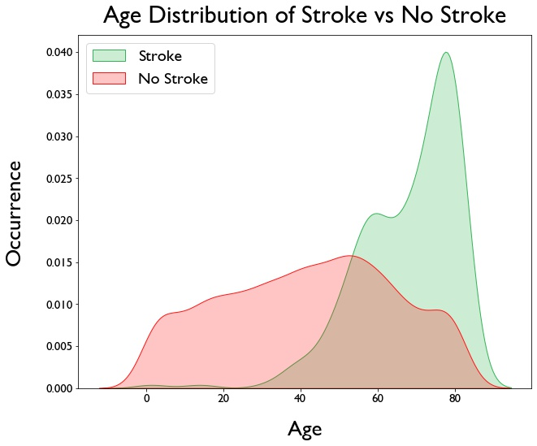
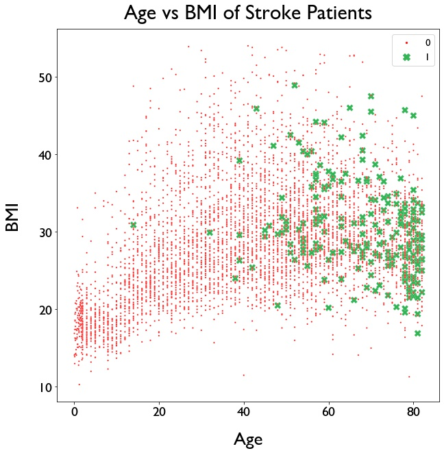

# Stroke Diagnostic Modeling

**Authors**: Anita Camlic, Eddie Juarez, Dermot O'Brien

## Overview
According to the World Health Organization (WHO) stroke is the 2nd leading cause of death globally, responsible for approximately 11% of total deaths.This dataset is used to predict whether a patient is likely to get stroke based on the input parameters like gender, age, various diseases, and smoking status. Each row in the data provides relavant information about the patient.

## Business Problem
Hospitals are constantly looking for new ways to detect health risks in their patients before they occur. We have been asked by Mount Sinai's Diagnostic team to create a model that can predict the likelihood of a stroke in their patients with the use of patient data. The model will flag patients who are at risk of a stroke and will give their general practitioners the opporutnity to work with them on health plans to prevent them from occuring. The model will act as a preliminary diagnosic tool available for all doctors, allowing them to better serve their patients. We will also highlgiht the features of the model that contribute the the most to the models predictions

## Data
For our model we used a dataset with 5,110 observations and 12 features. 
Below are the 12 features and the data contained in them.

### Data 
- `id`: unique identifier
- `gender`: "Male", "Female" or "Other"
- `sex`: Sex
- `age`: age of the patient
- `hypertension`: 0 if the patient doesn't have hypertension, 1 if the patient has hypertension
- `heart_disease`: 0 if the patient doesn't have any heart diseases, 1 if the patient has a heart disease
- `ever_married`: "No" or "Yes"
- `work_type`: children", "Govt_job", "Never_worked", "Private" or "Self-employed"
- ` Residence_type`: "Rural" or "Urban"
- `avg_glucose_level`: average glucose level in blood
- `bmi`: body mass index
- `smoking_status`: "formerly smoked", "never smoked", "smokes" or "Unknown"
- `stroke`: 1 if the patient had a stroke or 0 if not

**Note:** "Unknown" in smoking_status means that the information is unavailable for this patient

## Methods

We used multiple classification algorithms to learn from our dataset and classify new obsercations as either stroke patients or not. The final model we agreed upon was a XGBoost model with tuned hyperparameters. 

## Results
Our model was created to predict potential patients at risk of suffering from a stroke. We chose the metric recall because it is associated with decreasing the amount of false negative values of our model. Our final recall score was 98 percent. This means that our model, when ran on unseen data, predicted true positives correctly 98 percent of the time. Our model fitted our data very well. XGBoost uses the errors to improve itself which is very powerful. Our final model is way better than our baseline model. We are very confident that our model will generalize well on future unseen data.

This model will benefit the business if put to use because it will flag potential stroke victims, potentially saving thier lives due to early detection and early treament. This model is extremely powerful and can be very beneficial to Mount Sinai's Diagnostic Team.


### Visual 1


### Visual 2


### Visual 3


## Conclusions

In conclusion, we recommend that Mount Sinai takes our model and incorporates it as a tool for their doctors in preliminary diagnostics for their patients. Once doctors idenitfy those patients that are at risk of stroke, they can work to build comprehenive health plans in hopes of preventing strokes. The two attributes of a person we think doctors should focus most on are the age of the patient and their bmi levels. Our models have shown that these two features contribute greatly to the prediction of stroke cases. When focusing on patients, they should look to treat those older patients first, as well as those with high bmi's, possibly working to lower their bmi's as well.

One reason our analysis might not fully solve the busines problem is that our dataset is fairly small, so it might not have captured all of the possible cases of potential stroke victim. Another reason our analysis might not fully solve the business problem is because we don't have many features aligned with strokes. If we had more features that were linked to strokes, our model could be improved.

In the future, we would love to further explore health data and create a model that maintains our recall with in more comprehensive unseen data. We also would like to apply similar model techniques to health data to predict other illnesses like heart disease.

## For More Information

Please review our full analysis in [our Jupyter Notebook](./Final_Notebook.ipynb) or our [presentation](./Stroke_Diagnostic_Modeling_Presentation.PDF).

For any additional questions, please contact **Anita Camlic & anitacamlic@gmail.com, Eddie Juarez & ejuarez.nyc@gmail.com, Dermot O'Brien & dermot.obri@gmail.com**

## Repository Structure


```
├── README.md                                    <- The top-level README for reviewers of this project
├── Final_Notebook.ipynb                         <- Narrative documentation of analysis in Jupyter notebook
├── Stroke_Diagnostic_Modeling_Presentation.pdf  <- PDF version of project presentation
├── Data                                         <- Sourced externally 
├── Images                                       <- Sourced externally 
├── Results                                      <- Generated from code
└── Working_Notebooks                            <- Scratch notebooks                        
```
